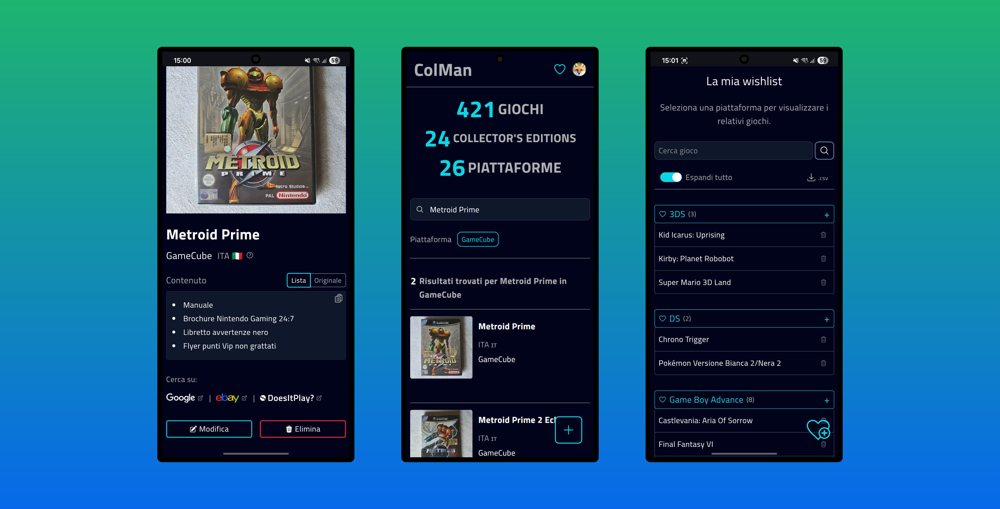

  <h1>ColMan</h1>

Colman sta per "Collection Manager". 

È una **PWA** (Progressive Web App) per smartphone che uso regolarmente per gestire la mia collezione di videogiochi. 

Nell’ultima versione ho implementato **un’architettura multi-user** a livello di database e applicazione, migliorando scalabilità e gestione. 

Si possono inserire/modificare/eliminare giochi e piattaforme direttamente nel database di Supabase (PostgreSQL), scattando la foto sul momento,selezionandola dalla galleria del telefono oppure su risorse esterne con link dinamici basati sui dati utente e compilando una vera e propria "scheda gioco" con le informazioni del gioco. 

C'è anche una **Wishlist** completa con funzioni di aggiunta e optimistic delete dei giochi, funzione di ricerca e link dinamici ai principali e-commerce di nuovo e usato per cercare i giochi in wishlist. 

**Privacy e sicurezza**: l'intera app è accessibile solo da utenti autorizzati e autenticati con Google OAuth (in futuro aggiungerò anche login via email/password), tutte le immagini degli utenti autenticati hanno url firmati e tutte le operazioni CRUD protette dalle rls policies di Supabase solo per gli utenti autenticati. 

E molto altro...(vedi features sotto)

Ho mantenuto un design semplice e tutta la UI/UX è improntata su rapidità, facilità e funzionalità con transizioni/animazioni css per dare più fluidità, ma anche optmistic updates, spinner di caricamento, skeleton loader e overlay durante i fetch e le server actions grazie a **Next.Js**, Suspense, useTransitions e useOptimistic di **React**. 

Le notifiche toast sono gestite con la fantastica libreria [React Hot Toast](https://github.com/timolins/react-hot-toast) 

**Questo progetto è interamente fatto a mano da zero e non sono stati usati componenti prefatti.**

---

## Features

#### [New 2026] PWA

L'applicazione è diventata una PWA!

#### [New 2026] Wishlist giochi

- Pagina della wishlist raggiungibile con link in homepage
- Funzione di ricerca giochi in wishlist
- Wishlist per utente autenticato con componenti accordion generati dinamicamente per ogni piattaforma e relativi giochi
- Interruttore per espandere tutti gli accordion delle piattaforme che contengono la lista giochi
- Button di eliminazione istantanea con optimistic update per ogni gioco nella lista
- Button per scaricare un file .csv con tutti i giochi in wishlist preordinati alfabeticamente in base alla piattaforma
- Back to top floating button dinamico con smooth scroll per tornare in cima alla lista
- Link dinamici basati sui dati utente ai principali e-commerce di nuovo e usato per cercare i giochi in wishlist

#### Esplorazione e gestione collezione

- Ricerca avanzata con filtri e aggiornamento in tempo reale dei risultati
- Pagina giochi con filtri e paginazione per utente autenticato
- Pagina statistiche della collezione

#### Gestione contenuti e metadati

- Creazione, modifica ed eliminazione di giochi e piattaforme con flussi guidati
- Supporto nativo a giochi sigillati, edizioni speciali e collector’s editions
- Supporto nativo per giochi completi e non completi con badge nelle card di anteprima e nella pagina del gioco
- Generazione automatica della lista dei contenuti a partire dal testo inserito
- Inserimento intelligente di testi di default e validazione in tempo reale degli input
- Immagini giochi di utenti autenticati in storage privato con url firmati

#### Pagina gioco avanzata

- Vista dedicata con badge visivi per tipologia di edizione
- Toggle tra contenuti originali e lista generata automaticamente
- Button di copia rapida della lista contenuti preformattata e con feedback animato
- Visualizzazione dinamica della regione tramite icone

#### Integrazioni esterne

- Link dinamici a Google ed eBay basati su titolo e piattaforma
- Verifica della completezza del gioco su supporto fisico tramite link dinamici a DoesItPlay
- Controllo durata gioco con link contestuale ad HowLongToBeat
- Link dinamici ai principali e-commerce di nuovo e usato per cercare i giochi in wishlist

#### Esperienza utente e feedback

- Conversione in formato .webp client side e resize automatico (mobile friendly) delle immagini inserite cercando di mantenere un equilibrio tra dimensioni e qualità
- Skeleton loader con shimmer effect, spinner e overlay animati durante fetch e server actions
- Notifiche toast per le operazioni principali e per gli errori
- Modal di conferma personalizzata per eliminazione gioco

---

## Tecnologie usate

<table>
<tr>
<td valign="top">

### Backend

- **Next.Js 16 (App Router)** per routing, login, server side rendering e server actions
- **Supabase (PostgreSQL)** per la gestione backend e database
- **Supabase Auth e Google OAuth** per login e autenticazione

</td>
<td valign="top">

### Frontend

- **React** con componenti funzionali e riutilizzabili
- **Tailwindcss** per styling modulare con UI consistente
- **React Hot Toast** per le notifiche dinamiche
- **Js-cookie** per gestione semplice dei cookies nel frontend

</td>
</tr>
</table>

Sviluppata con ❤️ da un essere umano.

> ⚠️ Quest'app è per uso personale, perciò è accessibile con uno specifico account.
